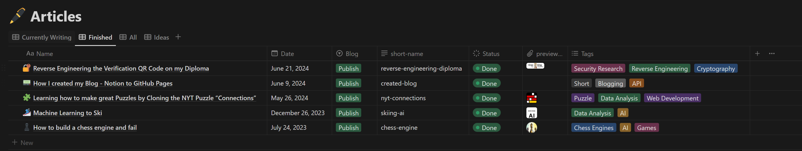
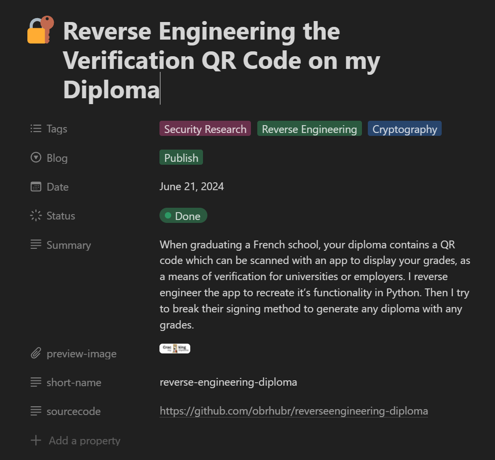

# Notion to Jekyll

This script was written for my blog [obrhubr.org](https://obrhubr.org). I use a Github Action that runs daily which downloads the posts from Notion and updates my Github Pages site.

It only downloads a post if it has been updated since it has been last downloaded.

In order for this to work you will need to have a database in your Notion which contains the following attributes: (be careful, these are case-sensitive)
 - `Tags` (Multi-Select)
 - `Blog` (Multi-Select with either `Preview` or `Publish`)
 - `Date` (Date)
 - `Summary` (Text)
 - `preview-image` (Image)
 - `short-name` (Text)
 - `sourcecode` (Text)
 - `last_downloaded` (Date)

The post will only be published if the `Blog` attribute is set to `Publish`.





## Install

Download this repository and run

```bash
pip install .
```

You will now be able to call `notion-to-jekyll` from anywhere.

## Usage

The script expects a few arguments to run correctly.
You will have to provide the Notion API token that you have configured to be able to access the DB and the id of the DB. They will need to either be in a `.env` file in your blog's source folder:

```bash
NOTION_TOKEN=secret_test
DB_ID=test
```

Or they will need to be passed with the following command line options:

```bash
notion-to-jekyll --notion-token secret_test --db-id test
```

### Arguments:

Either call `notion-to-jekyll --help` or see the following table for **optional** arguments:

#### Arguments to add logging
| Option | Usage |
|-	|-	|
| `--log`	| Log updated posts to Logsnag, expects LOGSNAG_TOKEN env var.	|

#### Arguments to add logging
| Option | Usage |
|-	|-	|
| `--assets-folder`	| Use an alternative output folder for the assets.	|
| `--output-folder`	| Use an alternative output folder for the posts. |

#### Arguments to specify which posts to download

| Option | Usage |
|-	|-	|
| `--download-all` | Download all posts.	|

#### Arguments that affect markdown formatting

| Option | Usage |
|-	|-	|
| `--use-katex`	| Use Katex formatting for equations.	|
| `--encode-jpg`	| Encode images as jpgs.	|
| `--rename-images`	| Rename images to a hash of their content.	|

## Example run

```
Starting Notion to Jekyll Exporter...
Loading secrets from the environment variables.
Found 5 blog posts to publish.
Downloading all posts.

1/5 - Exporting created-blog to Jekyll.
Downloading markdown from Notion.
Unzipping file...
Replacing image tags in markdown with correct paths.
Encode images to jpg.
Rename image to it's hash.
Downloading emoji as favicon: 📟
Inserting jekyll metadata.
Output formatted markdown file.

Exporting post created-blog: 100%|███████████████████████| 8/8 [00:06<00:00, 1.45 steps/s]

2/5 - Exporting reverse-engineering-diploma to Jekyll.
Downloading markdown from Notion.
Unzipping file...
Replacing image tags in markdown with correct paths.
Encode images to jpg.
Rename image to it's hash.
Formatting inline equations.
Downloading preview image from Notion.
Downloading emoji as favicon: 🔐
Inserting jekyll metadata.
Output formatted markdown file.

Exporting post reverse-engineering-diploma: 100%|███████████████████████| 8/8 [00:06<00:00, 1.45 steps/s]


3/5 - Exporting nyt-connections to Jekyll.
Downloading markdown from Notion.
Unzipping file...
Replacing image tags in markdown with correct paths.
Encode images to jpg.
Rename image to it's hash.
Downloading preview image from Notion.
Downloading emoji as favicon: 🧩
Inserting jekyll metadata.
Output formatted markdown file.

Exporting post nyt-connections: 100%|███████████████████████| 8/8 [00:06<00:00, 1.45 steps/s]

4/5 - Exporting skiing-ai to Jekyll.
Downloading markdown from Notion.
Unzipping file...
Replacing image tags in markdown with correct paths.
Encode images to jpg.
Rename image to it's hash.
Downloading preview image from Notion.
Downloading emoji as favicon: 🎿
Inserting jekyll metadata.
Output formatted markdown file.

Exporting post skiing-ai: 100%|███████████████████████| 8/8 [00:06<00:00, 1.45 steps/s]                                               
5/5 - Exporting chess-engine to Jekyll.
Downloading markdown from Notion.
Unzipping file...
Replacing image tags in markdown with correct paths.
Encode images to jpg.
Rename image to it's hash.
Downloading preview image from Notion.
Downloading emoji as favicon: ♟
Inserting jekyll metadata.
Output formatted markdown file.

Exporting post chess-engine: 100%|███████████████████████| 8/8 [00:06<00:00, 1.45 steps/s]


Finished exporting posts from Notion to Jekyll.
```

## Acknowledgments

This could not have been possible without the great [notion2md](https://github.com/echo724/notion2md) library.